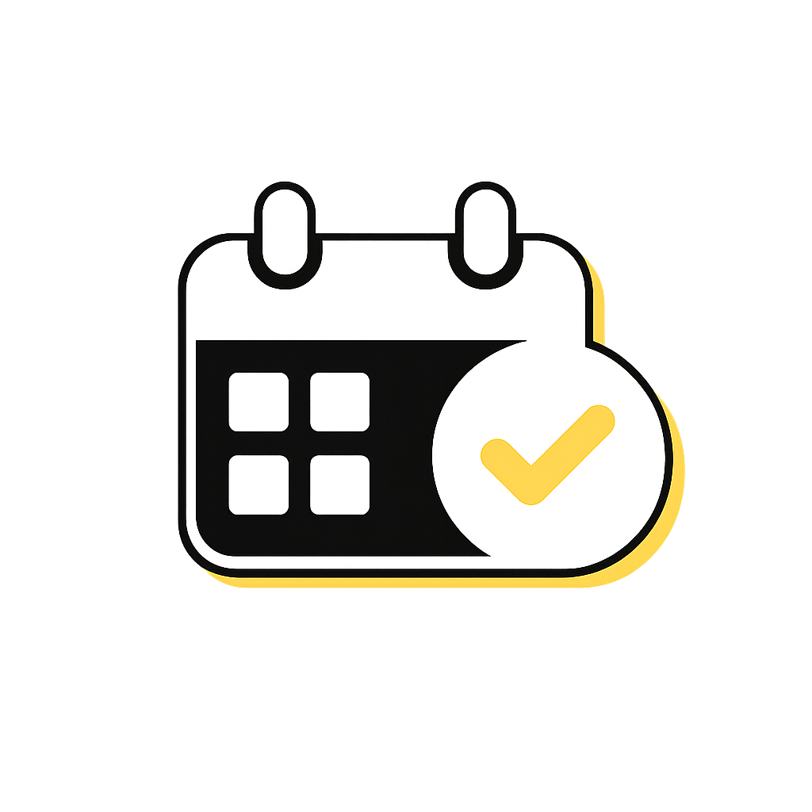

<p align="center">
  
</p>

<h1 align="center">Subber</h1>

<p align="center">
  <strong>Keep subscriptions, renewals, costs and reminders in one clean local app.</strong>
</p>

<p align="center">
  <a href="#italiano">Italiano</a> ·
  <a href="#english">English</a> ·
  <a href="https://github.com/carellice/subber/releases">GitHub Releases</a>
</p>

<p align="center">
  <a href="https://github.com/carellice/subber/releases/latest">
    
  </a>
  
  
  
  
</p>

---

## Italiano

Subber e' un'app per tenere sotto controllo gli abbonamenti: prezzo, categoria, data di rinnovo, promemoria e backup. Nasce come PWA React/Vite, ma puo' essere impacchettata anche per desktop con Electron e per Android con Capacitor.

### Funzionalita'

- Gestione abbonamenti con nome, prezzo, cadenza, categoria, note e data di rinnovo.
- Panoramica dei costi mensili e delle prossime scadenze.
- Categorie personalizzabili con colori dedicati.
- Preset visuali per servizi famosi come Netflix, Spotify, YouTube, Disney+, Google, Microsoft 365, DAZN, PlayStation, Xbox e altri.
- Promemoria locali prima del rinnovo.
- Tema automatico, chiaro o scuro.
- Dati salvati localmente sul dispositivo.
- Backup e ripristino tramite file JSON.
- Packaging per web, macOS, Windows e Android.

### Download

Le versioni pubblicate sono disponibili nella pagina:

[Scarica da GitHub Releases](https://github.com/carellice/subber/releases)

Per l'ultima versione:

[Latest release](https://github.com/carellice/subber/releases/latest)

### Requisiti

- Node.js LTS
- npm
- Android Studio, solo per generare APK Android
- Wine, opzionale su macOS per generare installer Windows

### Avvio in sviluppo

```bash
npm install
npm run dev
```

Apri l'indirizzo mostrato da Vite nel terminale.

### Build web

```bash
npm run build
```

L'output viene generato in `dist/`.

### App desktop e mobile

```bash
npm run desktop:dev
npm run package:mac
npm run package:win
npm run mobile:add:android
npm run package:apk
```

Per i dettagli completi sul packaging leggi [PACKAGING.md](./PACKAGING.md).

### Privacy

Subber salva i dati localmente. Nella versione web/PWA usa `localStorage`; nelle versioni desktop e Android usa lo storage locale del runtime. I backup JSON vengono creati solo quando li esporti manualmente.

---

## English

Subber is an app for tracking subscriptions: price, category, renewal date, reminders and backups. It starts as a React/Vite PWA, and can also be packaged as a desktop app with Electron or as an Android app with Capacitor.

### Features

- Subscription management with name, price, billing cadence, category, notes and renewal date.
- Overview of monthly costs and upcoming renewals.
- Custom categories with dedicated colors.
- Visual presets for popular services such as Netflix, Spotify, YouTube, Disney+, Google, Microsoft 365, DAZN, PlayStation, Xbox and more.
- Local reminders before renewals.
- Automatic, light and dark themes.
- Data stored locally on the device.
- JSON backup and restore.
- Packaging for web, macOS, Windows and Android.

### Download

Published builds are available on:

[Download from GitHub Releases](https://github.com/carellice/subber/releases)

For the newest build:

[Latest release](https://github.com/carellice/subber/releases/latest)

### Requirements

- Node.js LTS
- npm
- Android Studio, only for Android APK builds
- Wine, optional on macOS for Windows installer builds

### Development

```bash
npm install
npm run dev
```

Open the local URL printed by Vite in the terminal.

### Web build

```bash
npm run build
```

The output is generated in `dist/`.

### Desktop and mobile apps

```bash
npm run desktop:dev
npm run package:mac
npm run package:win
npm run mobile:add:android
npm run package:apk
```

For full packaging details, read [PACKAGING.md](./PACKAGING.md).

### Privacy

Subber keeps data local. The web/PWA version uses `localStorage`; desktop and Android builds use the local storage provided by their runtime. JSON backups are created only when you export them manually.
